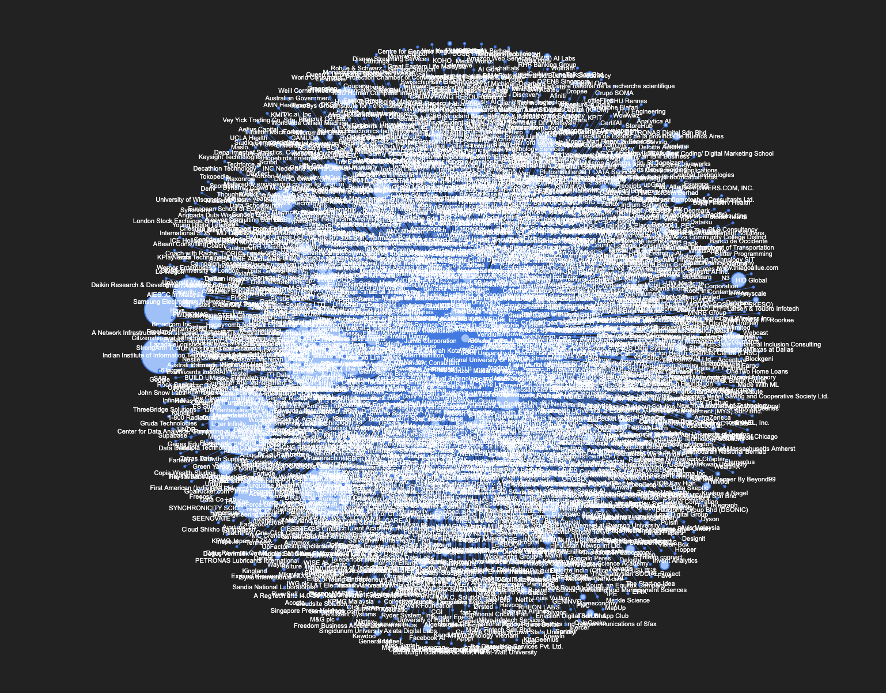

# Linkedin Connections Insights 🪄


## Features

- Total connections on LinkedIn
- Where most of your connections work at
- Who most of your connections are (what job title they hold)
- Who you last connected with
- Who you first connected with (send them a message!)
- Bar chart of top companies and positions
- Time series plot of your connections over time (find out when you had the most connections)
- A graph/network of your connections (see your connections in a graph)
- A wordcloud of your chat messages with your connections

## Run Locally

Clone the project

```bash
  git clone https://github.com/ttateluc/visa-vis.git
```

Go to the project directory

```bash
  cd visa-vis
```

### Using Docker

Build an Image

```bash
docker build -t visa-vis:1.0 .
```

Run the Image

```bash
docker run -p 8501:8501 visa-vis:1.0
```

The app is now live on http://localhost:8501/

### Using Conda

Create Conda environment

```bash
  conda create --name env_name python=3.8
```

Activate the environment

```bash
  conda activate env_name
```

Install requirements

```bash
  pip install -r requirements.txt
```

Run streamlit

```bash
  streamlit run app.py
```

### Using Poetry

first make sure you have python 3.8

```bash
  poetry install
```

```bash
  poetry run streamlit run app.py
```

## Contributing

Contributions are always welcome!

## All connections

My Connections' Place of Work


